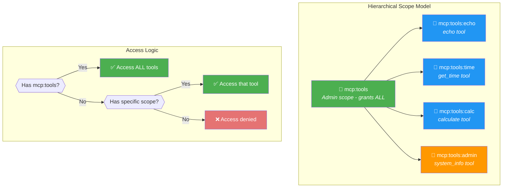
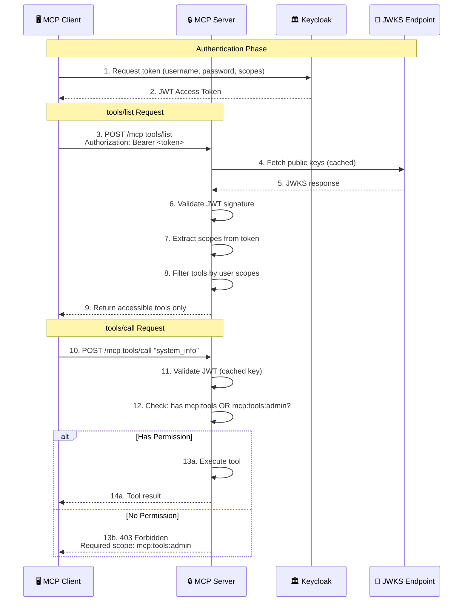

# Understanding MCP Authorization, Step by Step, Part Four

*This is Part Four of the series. See [Part One](https://blog.christianposta.com/understanding-mcp-authorization-step-by-step/), [Part Two](https://blog.christianposta.com/understanding-mcp-authorization-step-by-step-part-two/), and [Part Three](https://blog.christianposta.com/understanding-mcp-authorization-step-by-step-part-three/) for the foundation.*

In the previous parts of this series, we built an MCP server with HTTP transport, added OAuth 2.0 authentication, and integrated with Keycloak as our identity provider. By the end of Part Three (Step 10), we had a production-ready MCP server that validates JWT tokens and enforces broad scope-based access control (`mcp:read`, `mcp:tools`, `mcp:prompts`).

In this part, we'll take authorization to the next level:

- **Step 11**: (covered separately) Dynamic Client Registration
- **Step 12**: Per-tool RBAC with FastAPI — fine-grained, per-tool authorization
- **Step 13**: FastMCP with basic OAuth — rewriting our server using the FastMCP framework
- **Step 14**: FastMCP with per-tool RBAC — combining FastMCP's simplicity with fine-grained authorization

## Why Per-Tool Authorization?

Until now, our authorization model was coarse-grained: if a user had the `mcp:tools` scope, they could call *any* tool on the server. This is fine for simple use cases, but in real-world scenarios, you often need finer control:

- **Privileged operations**: Some tools might access sensitive system information or perform administrative tasks
- **Tiered access**: Different user tiers (guest, user, admin) should have access to different capabilities
- **Audit requirements**: Compliance might require that only certain roles can execute specific operations
- **AI safety**: When an LLM uses MCP tools, you want to limit which tools it can invoke based on the user's permissions

The MCP specification doesn't prescribe a specific authorization model beyond OAuth 2.0, giving us flexibility to implement whatever fits our needs. We'll use **hierarchical scopes** — a pattern where:

- `mcp:tools` grants access to ALL tools (hierarchical/admin scope)
- `mcp:tools:echo` grants access to only the `echo` tool
- `mcp:tools:admin` grants access to only the `system_info` tool

This approach is explicit, easy to understand, and maps naturally to OAuth 2.0 scopes.

### Scope Hierarchy Diagram

The following diagram illustrates how our hierarchical scope system works:



### Request Flow Diagram

This diagram shows how a request flows through the MCP server with per-tool RBAC:



## Step 12: Per-Tool RBAC with FastAPI

In this step, we extend our FastAPI-based MCP server with per-tool authorization. This is an educational implementation that shows exactly how per-tool RBAC works "under the hood."

### What's New in Step 12

1. **Tool Registry**: Central definition of tools with their required scopes
2. **Permission Checking**: Logic to verify if a user can access a specific tool
3. **Filtered tools/list**: Users only see tools they have permission to use
4. **Hierarchical Scopes**: `mcp:tools` grants access to all tools

### The Tool Registry

First, we define our tools with their required scopes:

```python
TOOL_DEFINITIONS = {
    "echo": {
        "required_scope": "mcp:tools:echo",
        "tool": Tool(
            name="echo",
            description="Echo a message back. Available to all authenticated users.",
            inputSchema=EchoRequest.model_json_schema(),
        ),
    },
    "get_time": {
        "required_scope": "mcp:tools:time",
        "tool": Tool(
            name="get_time",
            description="Get the current server time. Requires mcp:tools:time scope.",
            inputSchema={"type": "object", "properties": {}, "required": []},
        ),
    },
    "calculate": {
        "required_scope": "mcp:tools:calc",
        "tool": Tool(
            name="calculate",
            description="Perform basic arithmetic operations. Requires mcp:tools:calc scope.",
            inputSchema=CalculateRequest.model_json_schema(),
        ),
    },
    "system_info": {
        "required_scope": "mcp:tools:admin",
        "tool": Tool(
            name="system_info",
            description="Get server system information. Admin only - requires mcp:tools:admin scope.",
            inputSchema={"type": "object", "properties": {}, "required": []},
        ),
    },
}
```

Each tool has:
- A **name** that clients use to invoke it
- A **required_scope** that users must have
- The **tool definition** following the MCP specification

### Permission Checking with Hierarchical Scopes

The core of our RBAC system is the permission check:

```python
def check_tool_permission(self, scopes: List[str], tool_name: str) -> bool:
    """
    Check if user has permission to access a specific tool.

    Hierarchy:
    - mcp:tools grants access to ALL tools (hierarchical)
    - mcp:tools:<tool> grants access to specific tool only
    """
    # Hierarchical: mcp:tools grants access to all tools
    if "mcp:tools" in scopes:
        logger.info(f"Hierarchical access granted for tool '{tool_name}' via mcp:tools scope")
        return True

    # Check tool-specific scope
    tool_def = TOOL_DEFINITIONS.get(tool_name)
    if not tool_def:
        logger.warning(f"Unknown tool: {tool_name}")
        return False

    required_scope = tool_def["required_scope"]
    if required_scope in scopes:
        logger.info(f"Specific access granted for tool '{tool_name}' via {required_scope} scope")
        return True

    logger.warning(f"Access denied for tool '{tool_name}'. Required: {required_scope} or mcp:tools. User scopes: {scopes}")
    return False
```

The hierarchy is simple but powerful:
1. If the user has `mcp:tools`, they can access everything (admin-level access)
2. Otherwise, we check if they have the specific scope for that tool

### Filtered tools/list Response

A key feature of per-tool RBAC is that users should only *see* tools they can use. This prevents AI assistants from suggesting tools the user can't execute:

```python
def get_accessible_tools(self, scopes: List[str]) -> List[Tool]:
    """
    Get list of tools accessible to the user based on their scopes.
    Only returns tools the user has permission to call.
    """
    accessible = []
    for tool_name, tool_def in TOOL_DEFINITIONS.items():
        if self.check_tool_permission(scopes, tool_name):
            accessible.append(tool_def["tool"])
    return accessible
```

When handling `tools/list`, we return only accessible tools:

```python
elif mcp_request.method == "tools/list":
    # Return ONLY tools the user has access to
    accessible_tools = self.get_accessible_tools(scopes)
    logger.info(f"User '{username}' has access to {len(accessible_tools)} tools: {[t.name for t in accessible_tools]}")
    result = {
        "tools": [tool.model_dump() for tool in accessible_tools]
    }
```

### Enforcing Permissions on tools/call

When a user tries to call a tool, we verify their permission:

```python
elif mcp_request.method == "tools/call":
    tool_name = mcp_request.params.get("name") if mcp_request.params else None

    # Check per-tool permission
    if not self.check_tool_permission(scopes, tool_name):
        return self.forbidden_response(
            f"Insufficient permissions for tool '{tool_name}'",
            tool_name=tool_name
        )

    # Execute the tool...
```

The `forbidden_response` helper returns a helpful error:

```python
def forbidden_response(self, detail: str, tool_name: Optional[str] = None):
    """Return 403 Forbidden response with helpful information."""
    error_data = {"detail": detail}
    if tool_name and tool_name in TOOL_DEFINITIONS:
        error_data["required_scope"] = TOOL_DEFINITIONS[tool_name]["required_scope"]
        error_data["alternative_scope"] = "mcp:tools (grants access to all tools)"

    return JSONResponse(
        status_code=403,
        content={
            "jsonrpc": "2.0",
            "error": {
                "code": -32001,
                "message": "Forbidden",
                "data": error_data
            }
        }
    )
```

### Keycloak Configuration for Per-Tool Scopes

To support per-tool authorization, we need to configure Keycloak with the new scopes. Here's a snippet from our `keycloak/config.json`:

```json
{
  "clientScopes": [
    {
      "name": "mcp:tools",
      "description": "Access to execute ALL MCP tools (hierarchical)"
    },
    {
      "name": "mcp:tools:echo",
      "description": "Access to execute the echo tool"
    },
    {
      "name": "mcp:tools:time",
      "description": "Access to execute the get_time tool"
    },
    {
      "name": "mcp:tools:calc",
      "description": "Access to execute the calculate tool"
    },
    {
      "name": "mcp:tools:admin",
      "description": "Access to execute the system_info tool (admin only)"
    }
  ]
}
```

And users with different permission levels:

```json
{
  "users": [
    {
      "username": "mcp-admin",
      "password": "admin123",
      "clientRoles": {
        "echo-mcp-server": ["tools", "prompts", "read-only"]
      }
    },
    {
      "username": "mcp-user",
      "password": "user123",
      "clientRoles": {
        "echo-mcp-server": ["tools-echo", "tools-time", "tools-calc", "read-only"]
      }
    },
    {
      "username": "mcp-guest",
      "password": "guest123",
      "clientRoles": {
        "echo-mcp-server": ["tools-echo", "read-only"]
      }
    },
    {
      "username": "mcp-readonly",
      "password": "readonly123",
      "clientRoles": {
        "echo-mcp-server": ["read-only"]
      }
    }
  ]
}
```

### Testing Step 12

Let's run Step 12 and test our per-tool RBAC:

```bash
# Start the server
uv run step12

# In another terminal, run the test script
./test_step12.sh
```

The test script validates our permission matrix:

| User          | echo | get_time | calculate | system_info |
|---------------|------|----------|-----------|-------------|
| mcp-admin     | ✓    | ✓        | ✓         | ✓           |
| mcp-user      | ✓    | ✓        | ✓         | ✗           |
| mcp-guest     | ✓    | ✗        | ✗         | ✗           |
| mcp-readonly  | ✗    | ✗        | ✗         | ✗           |

Let's see what `tools/list` returns for different users:

```bash
# Get token for admin
ADMIN_TOKEN=$(curl -s -X POST "http://localhost:8080/realms/mcp-realm/protocol/openid-connect/token" \
  -H "Content-Type: application/x-www-form-urlencoded" \
  -d "grant_type=password" \
  -d "client_id=mcp-test-client" \
  -d "username=mcp-admin" \
  -d "password=admin123" \
  -d "scope=openid mcp:tools" | jq -r '.access_token')

# Admin sees all tools
curl -s -X POST "http://localhost:9000/mcp" \
  -H "Authorization: Bearer $ADMIN_TOKEN" \
  -H "Content-Type: application/json" \
  -d '{"jsonrpc": "2.0", "id": 1, "method": "tools/list"}' | jq '.result.tools[].name'

# Output: "echo", "get_time", "calculate", "system_info"
```

```bash
# Get token for guest
GUEST_TOKEN=$(curl -s -X POST "http://localhost:8080/realms/mcp-realm/protocol/openid-connect/token" \
  -H "Content-Type: application/x-www-form-urlencoded" \
  -d "grant_type=password" \
  -d "client_id=mcp-test-client" \
  -d "username=mcp-guest" \
  -d "password=guest123" \
  -d "scope=openid mcp:tools:echo" | jq -r '.access_token')

# Guest sees only echo
curl -s -X POST "http://localhost:9000/mcp" \
  -H "Authorization: Bearer $GUEST_TOKEN" \
  -H "Content-Type: application/json" \
  -d '{"jsonrpc": "2.0", "id": 1, "method": "tools/list"}' | jq '.result.tools[].name'

# Output: "echo"
```

And if the guest tries to call a tool they don't have access to:

```bash
curl -s -X POST "http://localhost:9000/mcp" \
  -H "Authorization: Bearer $GUEST_TOKEN" \
  -H "Content-Type: application/json" \
  -d '{"jsonrpc": "2.0", "id": 1, "method": "tools/call", "params": {"name": "system_info", "arguments": {}}}' | jq '.'
```

```json
{
  "jsonrpc": "2.0",
  "id": 1,
  "error": {
    "code": -32001,
    "message": "Forbidden",
    "data": {
      "detail": "Insufficient permissions for tool 'system_info'",
      "required_scope": "mcp:tools:admin",
      "alternative_scope": "mcp:tools (grants access to all tools)"
    }
  }
}
```

The full source code for Step 12 is available at [src/mcp_http/step12.py](../src/mcp_http/step12.py).

## Step 13: FastMCP with Basic OAuth

Now let's rewrite our MCP server using [FastMCP](https://github.com/jlowin/fastmcp), a modern Python framework for building MCP servers. FastMCP provides:

- Built-in JWT verification with `JWTVerifier`
- OAuth integration via `RemoteAuthProvider`
- Simple `@mcp.tool` decorator for defining tools
- Automatic JSON-RPC handling

### What's New in Step 13

1. **FastMCP framework**: Replace manual FastAPI implementation
2. **JWTVerifier**: Built-in JWKS fetching and token validation
3. **RemoteAuthProvider**: OAuth integration with authorization servers
4. **get_access_token()**: Easy access to current user's token

### The Complete Server in ~200 Lines

Here's how simple our server becomes with FastMCP:

```python
from fastmcp import FastMCP
from fastmcp.server.auth import RemoteAuthProvider
from fastmcp.server.auth.providers.jwt import JWTVerifier
from fastmcp.server.dependencies import get_access_token, AccessToken

# Configure JWT verification with Keycloak
token_verifier = JWTVerifier(
    jwks_uri=f"{KEYCLOAK_URL}/realms/{KEYCLOAK_REALM}/protocol/openid-connect/certs",
    issuer=JWT_ISSUER,
    audience=JWT_AUDIENCE,
)

# Create RemoteAuthProvider for OAuth integration
auth = RemoteAuthProvider(
    token_verifier=token_verifier,
    authorization_servers=[AnyHttpUrl(f"{KEYCLOAK_URL}/realms/{KEYCLOAK_REALM}")],
    base_url=MCP_SERVER_URL,
)

# Create FastMCP server with authentication
mcp = FastMCP(
    name="MCP Server with OAuth (FastMCP)",
    auth=auth,
)
```

That's it! The JWT validation, JWKS caching, and OAuth metadata endpoints are all handled by FastMCP.

### Defining Tools with Decorators

Instead of manual tool registration, we use decorators:

```python
@mcp.tool
async def echo(message: str, repeat_count: int = 1) -> str:
    """
    Echo a message back.

    Args:
        message: The message to echo
        repeat_count: Number of times to repeat (1-10)

    Returns:
        The echoed message
    """
    if repeat_count < 1:
        repeat_count = 1
    if repeat_count > 10:
        repeat_count = 10

    return message * repeat_count


@mcp.tool
async def get_time() -> str:
    """Get the current server time."""
    current_time = datetime.now().isoformat()
    return f"Current server time: {current_time}"


@mcp.tool
async def calculate(operation: str, a: float, b: float) -> str:
    """Perform basic arithmetic operations."""
    operations = {
        "add": lambda x, y: x + y,
        "subtract": lambda x, y: x - y,
        "multiply": lambda x, y: x * y,
        "divide": lambda x, y: x / y if y != 0 else "Error: Division by zero",
    }

    if operation not in operations:
        return f"Error: Unknown operation '{operation}'"

    result = operations[operation](a, b)
    return f"{a} {operation} {b} = {result}"
```

FastMCP automatically:
- Generates the JSON schema from function signatures
- Handles JSON-RPC request/response formatting
- Manages tool listing and invocation

### Accessing User Information

FastMCP provides `get_access_token()` to access the current user's token:

```python
def get_user_info() -> dict:
    """Get information about the current authenticated user."""
    token: AccessToken | None = get_access_token()
    if token is None:
        return {"authenticated": False}

    return {
        "authenticated": True,
        "client_id": token.client_id,
        "scopes": token.scopes,
        "claims": token.claims,
    }


@mcp.tool
async def whoami() -> str:
    """Get information about the authenticated user."""
    user = get_user_info()
    return json.dumps({
        "authenticated": user.get("authenticated", False),
        "client_id": user.get("client_id"),
        "scopes": user.get("scopes", []),
    }, indent=2)
```

### Running the Server

```python
def main():
    print(f"[STARTUP] FastMCP Server with OAuth Authentication")
    print(f"[STARTUP] Keycloak URL: {KEYCLOAK_URL}")
    print(f"[STARTUP] All tools available to authenticated users")

    # Run with HTTP transport on port 9000
    mcp.run(transport="http", host="0.0.0.0", port=9000)
```

### Code Comparison: FastAPI vs FastMCP

| Aspect              | Step 10/12 (FastAPI)     | Step 13 (FastMCP)        |
|---------------------|--------------------------|--------------------------|
| JWT Validation      | Manual JWKS fetch        | JWTVerifier built-in     |
| OAuth Integration   | Custom endpoints         | RemoteAuthProvider       |
| Token Access        | Depends injection        | get_access_token()       |
| Lines of Code       | ~400-600 lines           | ~150-200 lines           |
| Tool Definition     | Manual registry          | @mcp.tool decorator      |
| Error Handling      | Custom JSON-RPC          | Framework handles        |

The full source code for Step 13 is available at [src/mcp_http/step13.py](../src/mcp_http/step13.py).

## Step 14: FastMCP with Per-Tool RBAC

Step 13 gave us the simplicity of FastMCP, but all tools were available to any authenticated user. In Step 14, we bring back per-tool RBAC while keeping FastMCP's elegance.

### What's New in Step 14

1. **TOOL_SCOPES mapping**: Define required scopes for each tool
2. **Permission helpers**: `has_tool_permission()` and `require_tool_permission()`
3. **RBACFastMCP subclass**: Custom FastMCP that filters `tools/list`
4. **Tool-level enforcement**: Each tool checks its own permissions

### Tool Scope Requirements

```python
TOOL_SCOPES = {
    "echo": "mcp:tools:echo",
    "get_time": "mcp:tools:time",
    "calculate": "mcp:tools:calc",
    "system_info": "mcp:tools:admin",
}
```

### Authorization Helpers

```python
def _check_tool_permission_with_scopes(scopes: list, tool_name: str) -> bool:
    """Check if scopes grant access to a tool."""
    # Hierarchical: mcp:tools grants access to all tools
    if "mcp:tools" in scopes:
        return True

    # Check tool-specific scope
    required_scope = TOOL_SCOPES.get(tool_name)
    if required_scope and required_scope in scopes:
        return True

    return False


def has_tool_permission(tool_name: str) -> bool:
    """Check if the current user has permission to use a specific tool."""
    token: AccessToken | None = get_access_token()
    if token is None:
        return False

    scopes = token.scopes or []
    return _check_tool_permission_with_scopes(scopes, tool_name)


def require_tool_permission(tool_name: str) -> None:
    """Raise an error if the user doesn't have permission for the tool."""
    if not has_tool_permission(tool_name):
        required = TOOL_SCOPES.get(tool_name, "unknown")
        raise ValueError(
            f"Insufficient permissions for tool '{tool_name}'. "
            f"Required scope: {required} or mcp:tools (hierarchical)"
        )
```

### Custom FastMCP with Filtered tools/list

The key innovation in Step 14 is subclassing FastMCP to filter the tools list:

```python
class RBACFastMCP(FastMCP):
    """
    FastMCP subclass that filters tools/list based on user permissions.

    This ensures users only see tools they have permission to use,
    preventing the AI from suggesting unavailable tools.
    """

    def _setup_handlers(self) -> None:
        """Set up core MCP protocol handlers with custom RBAC filtering."""
        # Register our filtered list_tools instead of the default
        self._mcp_server.list_tools()(self._filtered_list_tools)
        # Keep default handlers for everything else
        self._mcp_server.call_tool(validate_input=self.strict_input_validation)(
            self._call_tool_mcp
        )
        # ... other handlers remain unchanged

    async def _filtered_list_tools(self) -> List[MCPTool]:
        """List only tools the current user has permission to access."""
        all_tools = await self._tool_manager.get_tools()

        # Get current user's scopes
        token: AccessToken | None = get_access_token()
        scopes = token.scopes if token else []

        # Filter tools based on permissions
        accessible_tools = []
        for key, tool in all_tools.items():
            tool_name = tool.name
            if tool_name == "whoami" or _check_tool_permission_with_scopes(scopes, tool_name):
                accessible_tools.append(tool.to_mcp_tool(name=key))

        return accessible_tools
```

### Tools with Permission Checks

Each tool now enforces its own permission:

```python
@mcp.tool
async def echo(message: str, repeat_count: int = 1) -> str:
    """Echo a message back. Requires mcp:tools:echo scope."""
    require_tool_permission("echo")  # <-- Permission check

    if repeat_count < 1:
        repeat_count = 1
    if repeat_count > 10:
        repeat_count = 10

    return message * repeat_count


@mcp.tool
async def system_info() -> str:
    """Get server system information. Admin only - requires mcp:tools:admin scope."""
    require_tool_permission("system_info")  # <-- Permission check

    info = {
        "platform": platform.system(),
        "platform_release": platform.release(),
        # ...
    }
    return json.dumps(info, indent=2)
```

### The whoami Tool

A special `whoami` tool is available to all authenticated users and shows their permissions:

```python
@mcp.tool
async def whoami() -> str:
    """
    Get information about the authenticated user and their permissions.
    This tool is available to all authenticated users.
    """
    user = get_user_info()

    # Determine which tools the user can access
    accessible_tools = []
    for tool_name in TOOL_SCOPES.keys():
        if has_tool_permission(tool_name):
            accessible_tools.append(tool_name)

    result = {
        "authenticated": user.get("authenticated", False),
        "client_id": user.get("client_id"),
        "scopes": user.get("scopes", []),
        "accessible_tools": accessible_tools,
        "scope_hierarchy": {
            "mcp:tools": "Grants access to ALL tools",
            "mcp:tools:echo": "echo tool only",
            "mcp:tools:time": "get_time tool only",
            "mcp:tools:calc": "calculate tool only",
            "mcp:tools:admin": "system_info tool only (admin)",
        }
    }
    return json.dumps(result, indent=2)
```

### Testing Step 14

```bash
# Start the server
uv run step14

# In another terminal, run the test script
uv run python test_step14.py
```

The test validates the same permission matrix as Step 12, but using the FastMCP implementation.

The full source code for Step 14 is available at [src/mcp_http/step14.py](../src/mcp_http/step14.py).

## Summary

In this part, we've extended our MCP server with fine-grained authorization:

| Step | Framework | Features |
|------|-----------|----------|
| 12   | FastAPI   | Per-tool RBAC, filtered tools/list, hierarchical scopes |
| 13   | FastMCP   | Basic OAuth, simplified code, built-in JWT handling |
| 14   | FastMCP   | Per-tool RBAC + FastMCP simplicity |

### Key Takeaways

1. **Hierarchical scopes** provide a clean authorization model: `mcp:tools` for admin access, `mcp:tools:<name>` for specific tools

2. **Filtered tools/list** is crucial for AI assistants — they should only see tools they can actually use

3. **FastMCP** dramatically reduces boilerplate while maintaining full functionality

4. **Defense in depth**: Filter the list AND enforce on execution — don't rely on just one

### User Access Matrix

| User          | Scopes                                    | Accessible Tools              |
|---------------|-------------------------------------------|-------------------------------|
| mcp-admin     | mcp:tools                                 | ALL tools                     |
| mcp-user      | mcp:tools:echo, mcp:tools:time, mcp:tools:calc | echo, get_time, calculate    |
| mcp-guest     | mcp:tools:echo                            | echo only                     |
| mcp-readonly  | mcp:read                                  | No tools                      |

### Where to Go from Here?

- **Dynamic scope discovery**: Let clients discover available scopes via OAuth metadata
- **Role-based policies**: Integrate with external policy engines like OPA
- **Audit logging**: Log all tool invocations for compliance
- **Rate limiting**: Per-tool rate limits based on user tier
- **Tool versioning**: Different users get access to different tool versions

The complete source code for all steps is available in the [mcp-auth-step-by-step repository](https://github.com/kratocz/mcp-auth-step-by-step).
